# **_Mecca Travel_**

Mecca Travel is an information guide website to help better inform travellers on thier journey to Mecca. This site is targeted to tourists (also known as performing Umrah) and people looking to perform Hajj and its entry requirements. Mecca Travel will be useful to help guide people through the process of planning their journey.

May your journey be peaceful and your prayers answered <a href="https://s-shah93.github.io/Project-1---HTML-CSS/" target="_blank" rel="noopener">Mecca Travel</a>

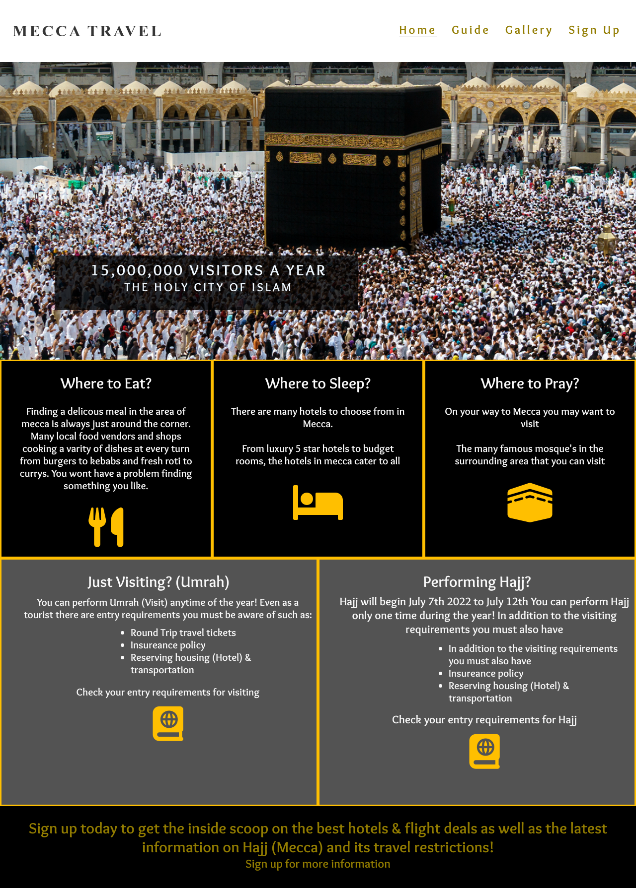

# Contents

* [**User Experience UX**](<#user-experience-ux>)
    * [Wireframes](<#wireframes>)
    * [Site Structure](<#site-structure>)
    * [Design Choices](<#design-choices>)
    *  [Typography](<#typography>)
    *  [Colour Scheme](<#colour-scheme>)
* [**Features**](<#features>)
    * [**Home**](<#navigation-menu>)
         * [Navigation menu](<#navigation-menu>)
         * [Links (icons)](<#testimonials>)
         * [Footer](<#footer>)
    * [**Guide**](<#projects>)
        * Guide apply
        * Guide travel
        * Guide sleep
        * Guide Eat
        * Guide Pray
    * [**Gallery**](<#inspiration>)
        * Photos
    * [**Signup**](<#contact-us>)
       * User contact information
       * Design Query form
    * [**Form Confirmation**](<#form-confirmation>)
* [**Testing**](<#testing>)
* [**Deployment**](<#deployment>)
* [**Credits**](<#credits>)
    * [**Content**](<#content>)
    * [**Media**](<#media>)
*  [**Acknowledgements**](<#acknowledgements>)

# Wireframes

# Site Structure

Mecca Travels website has 4 pages. The [home page](index.html) is the default loading page, [guide](guide.html), [gallery](gallery.html) and [sign up](signup.html) are accessable primarily from the navigation menu. There is another page (not on the navigation menu) to let the user know their form has been submitted[signed up](signedup.html).

[Back to top](<#contents>)

## Design Choices

 * ### Typography
    The fonts chosen were 'Titan One' for the headings and 'Overlock' for the body text. They fall back to Lato and cursive respectively. 
    * "Titan One" was chosen for the headings to give the user an inital relaxed feel, the cursive design gives the user a less intimidating feel over the others.
    * "Overlock" is used for the body text as it provides a nice contrast to the headings being easy on the eyes for the reader.

 * ### Colour Scheme
      The colour scheme eventually chosen is one based on White, Black and Gold. The colour blends well with the Kaaba and its surrounding colours in many of the images. White and Black, can give the impression of good and bad like the yin and yang sign for light and dark. The purpose of the journey for the traveller will be for good or bad either to say thanks to Allah(God) or to ask for forgivness.

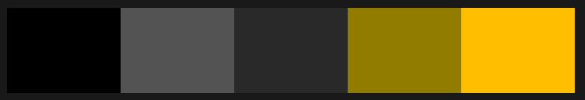

[Back to top](<#contents>)

# Features

Mecca Travels website is set up to be informative and easy to use. It contains many features that the user would probably be familiar with, such as a navigation bar and sign up form. The overall feel of the website is intended to be ralaxed and ease the pressure of orginising a trip to Mecca.

## Existing Features  
  * ### Navigation Menu

    * Sited at the top of all the pages in the site, it is fully responsive and contains links to all the pages of the site to enable ease of navigation in one convenient location.
    * The logo is clickable with a link back to the home page for enhanced UX.

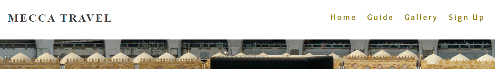

[Back to top](<#contents>)

* ### Links (icons)

  * Located on the home page to help the user navigate to the relivent page for more detail. It was intended to make the homepage relatively plain to locate a quick answer for the users question.
  * A responsively styled grid of simple information blocks to let the user know the key points when travelling. 

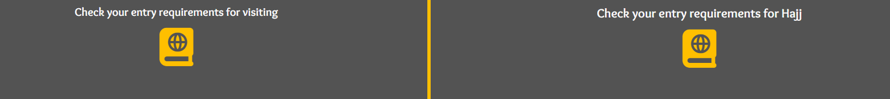

[Back to top](<#contents>)

* ### Footer
    
    * Contains sign up form page link. To enhance the UX the link opens in other tabs.
    * The sign up form link will encourage them to connect with Mecca Travel to stay up to date with the latest information when travelling to Mecca.
    * On the sign up form page the footer is designed to help the user navigate back to the sites pages for more information.

    
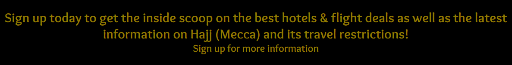

[Back to top](<#contents>)

* ### Guide
    * The guide page gives the user a more in depth look at the requirements when travelling to Mecca with links to the Saudi Arabia offical website to check specific requirements for your own country.
    * There is information and links to help the user plan thier trip in terms of hotel bookings and flights as well as places to eat and visit.
    * What happens in Mecca section helps the user understand the process of performing Hajj and Umrah.

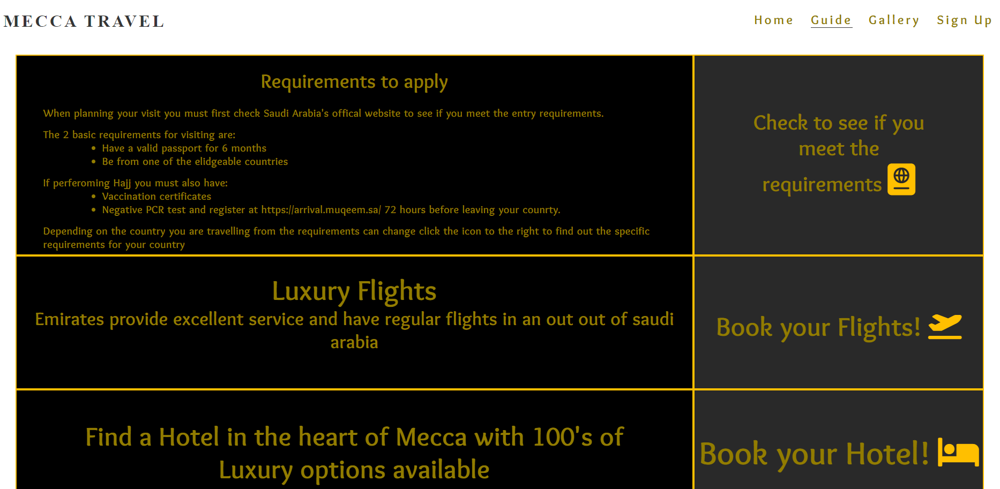

[Back to top](<#contents>)

 * ### Gallery

      * Located on the gallery page through the navigation bar. It was intended to make the user experience easy. The section is relatively plain to enable a focus on the images in the gallery.
      * A responsively styled grid of images to give the user a smooth view across all devices. 

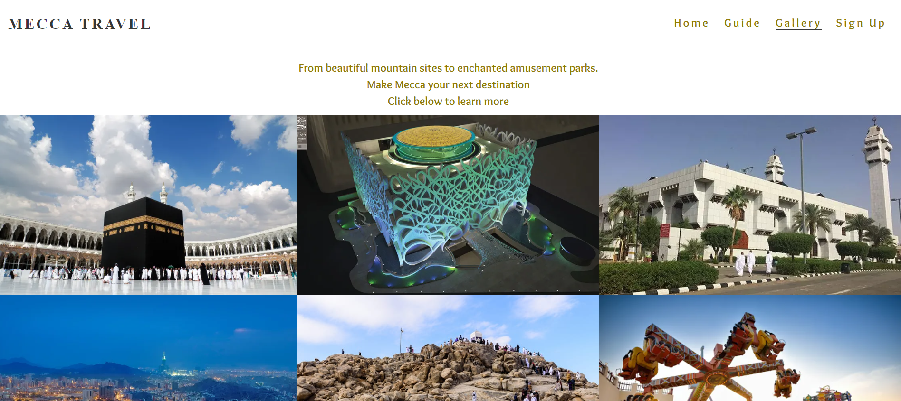

[Back to top](<#contents>)

* ### Sign Up

    * This section should complete the online journey for the user. 
    * It has a form for the purpose of the user wanting more information on travel deals and changing requirements for entry into the country.
    * There is a form that the user can choose to fill in. It has 5 input fields, first name, last name, email address, and 3 radio input options to choose their preference of information they wish to receive. 

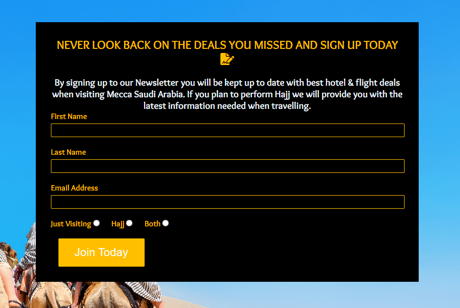
[Back to top](<#contents>)

* ### Form Confirmation
    * This page confirms for the user that their details have been sent to Mecca Travel. For this project it validates the form only.
    * It provides a direct link back to the contact page as well as the normal navigation menu links in the header.
    * The footer is different on this page as they are already on the sign up page and this footer helps the user naviagate back to the website.

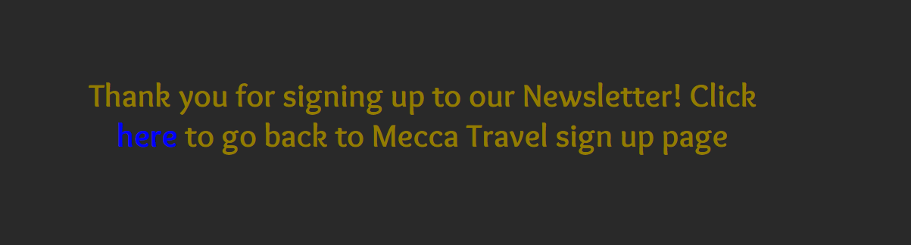

[Back to top](<#contents>)

# Testing

Please refer to [**_here_**](Testing.md) for more information on testing Wawas Woods.

[Back to top](<#contents>)

# Deployment

### **To deploy the project**
The site was deployed to GitHub pages. The steps to deploy a site are as follows:
  1. In the GitHub repository, navigate to the **Project**.
  2. In the GitHub project, navigate to the **Settings** tab.
  3. Once in Settings, navigate to the **Pages** tab on the left hand side.
  4. Under **Source**, select the branch to **main**, then click **save**.
  5. Once the master branch has been selected, then refresh the page to see your link with a check mark.

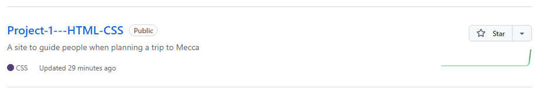
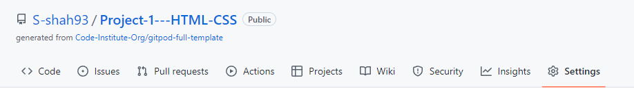
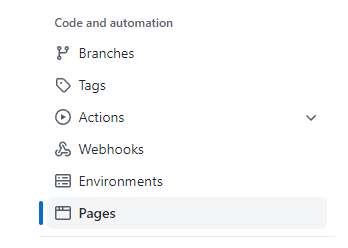
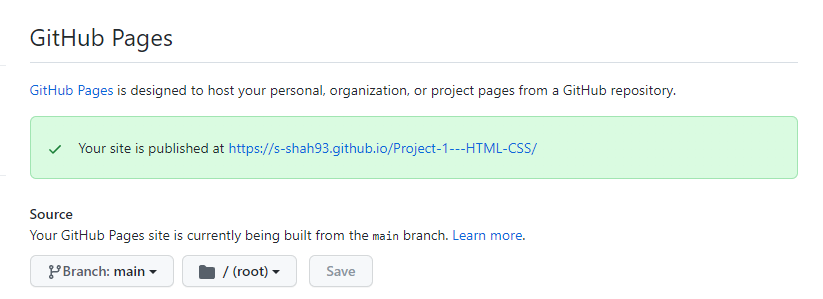

  The live link to the Github repository can be found here - https://s-shah93.github.io/Project-1---HTML-CSS/

### **To fork the repository on GitHub**
A copy of the GitHub Repository can be made by forking the GitHub account. This copy can be viewed and changes can be made to the copy without affecting the original repository. Take the following steps to fork the repository;
1. Log in to **GitHub** and locate the [repository](https://github.com/S-shah93/Project-1---HTML-CSS).
2. On the right hand side of the page inline with the repository name is a button called **'Fork'**, click on the button to create a copy of the original repository in your GitHub Account.

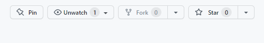

### **To create a local clone of this project**
The method from cloning a project from GitHub is below:

1. Under the repository’s name, click on the **code** tab.
2. In the **Clone with HTTPS** section, click on the clipboard icon to copy the given URL.

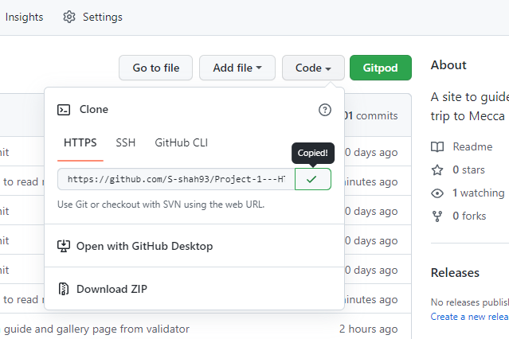

3. In your IDE of choice, open **Git Bash**.
4. Change the current working directory to the location where you want the cloned directory to be made.
5. Type **git clone**, and then paste the URL copied from GitHub.
6. Press **enter** and the local clone will be created.

[Back to top](<#contents>)

# Credits
### Content

* The font came from [Google Fonts](https://fonts.google.com/).
* The colour palate was compiled by [Colormind](http://colormind.io/).
* The icons came from [Font Awesome](https://fontawesome.com/).
* [Balsamiq](https://balsamiq.com/wireframes/) was used to create the wireframes.

### Media
* The photos for the gallery came from , [Thrillophilia](https://www.thrillophilia.com/).
* The background image for the homepage header and signup page came from, [Adobe Stock](https://stock.adobe.com/ie/)
* The photos were resized for header homepage and signup page backgrounds using [iLoveimg](https://www.iloveimg.com/).

[Back to top](<#contents>)

# Acknowledgements
The site was completed as a Portfolio 1 Project piece for the Full Stack Software Developer Diploma at the [Code Institute](https://codeinstitute.net/). As such I would like to thank my mentor [Precious Ijege](https://www.linkedin.com/in/precious-ijege-908a00168/), the Slack community, and all at the Code Institute for their help and support. Mecca Travel is a information site that I thought could be benifictial for people travelling to Mecca.

Ewan Colquhoun 2021.

[Back to top](<#contents>)