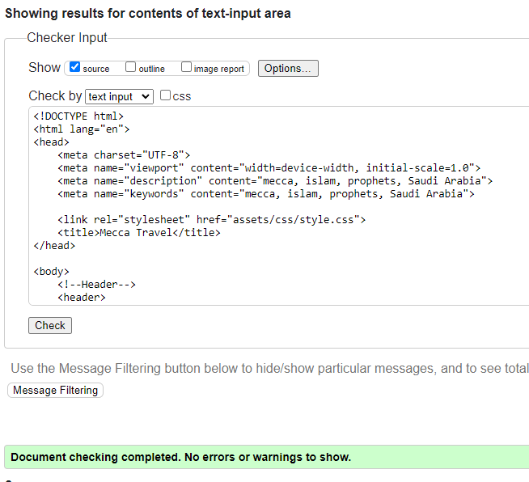

# Testing
## Code Validation
The Mecca Travel website has be throughly tested. All the code has been run through the [W3C html Validator](https://validator.w3.org/) and the [W3C CSS Validator](https://jigsaw.w3.org/css-validator/). Minor errors were found on the guide and gallery pages. After a fix and retest, no errors were returned for both. 

The HTML validator results for URL link for HTML and CSS are below below:

* Website HTML URL link

* Website CSS URL link

The HTML validator results for each page are below:

* Home page direct input

* Guide page direct input

* Gallery page direct input

* Signup page direct input
 

* Signed up page direct input

* CSS direct input

## Responsiveness Test

* The responsive design tests were carried out manually with [Google Chrome DevTools](https://developer.chrome.com/docs/devtools/)

## Browser Compatibility

Mecca Travel website was tested on the following browsers with no visible issues for the user. 
Google Chrome, Microsoft Edge. Appearance, functionality and responsiveness were consistent throughout for a range of device sizes and browsers.

## Known Bugs
* ### Resolved

    * The guide page had open stray tags and p elements as a child of ul which needed to be changed.
    * The guide page information was cramped on smaller devices, each section was designed to stack on top of each other for a better experience.
    * The gallery page had broken images in them which were rosolved but upon deploying the site the images would remain broken. 3 images were removed to give the gallery an even number of pictures for desktop view.
    * During validation many bugs became known during the validation stage, a brief description is below:

This was an oversight from the development phase when the font size and height was being modified. It was easily fixed by using the correct closing tag, as well as a duplicate id being used.

The p element was inside the table ul which needed to be fixed; using 2 new id tags for the seperate tables. It was easily fixed by ensuring that the p element was outside of the list.

* ### Unresolved
    * The form, on the face of it acts like you would expect it to, it acknowledges your data input, however the data doesn't push anywhere. This is a limitation within this project and would be rectified for a true deployment of the Mecca Travel website.
    * The header image on the home page needs to be changed for mobile devices as the picture is too large to adjust appropriately for mobile size devices.

    ## Additional Testing
### Lighthouse
The site was also tested using [Google Lighthouse](https://developers.google.com/web/tools/lighthouse) in Chrome Developer Tools to test each of the pages for:
* Performance - How the page performs whilst loading.
* Accessibility - Is the site acccessible for all users and how can it be improved.
* Best Practices - Site conforms to industry best practices.
* SEO - Search engine optimisation. Is the site optimised for search engine result rankings.

As an example the results for Mecca Travel home page are below:

